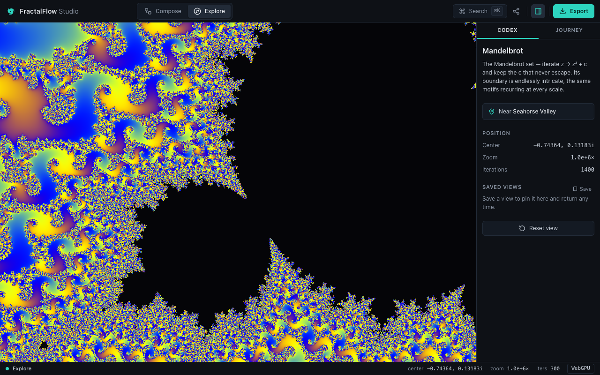

<div align="center">


# FractalFlow Studio

**A GPU-native, local-first studio for crafting beautiful, colorful fractal art in the browser.**

[](https://github.com/PouyanJay/fractalflow/actions/workflows/ci.yaml)
[](https://github.com/PouyanJay/fractalflow/actions/workflows/deploy.yaml)
[](LICENSE)
[](https://svelte.dev/)
[](https://www.w3.org/TR/webgpu/)

### [▶ Live demo](https://pouyanjay.github.io/fractalflow/)



</div>

---

FractalFlow turns the mathematics of fractals into a polished creative tool. It
renders the Mandelbrot set and friends entirely on the GPU, zooms ~10²⁸× deep
without losing detail, and lets you compose, animate, and export the results —
all client-side, with nothing to install and nothing sent to a server.

## Features

**Four art styles, one engine**

- 🌀 **Colorful Deep-Zoom 2D** — Mandelbrot, Julia, Burning Ship, and Tricorn,
  with cinematic deep zoom (see below).
- 🔮 **Geometric 3D** — a raymarched Mandelbulb distance field.
- ✨ **Glowing Attractors** — Clifford / de Jong / Lorenz / Thomas strange
  attractors, accumulated on the GPU (WebGPU compute).
- 🔥 **Painterly Flames** — flam3-style fractal flames via the chaos game
  (WebGPU compute).

**Cinematic deep zoom**

- **Perturbation + rebasing** keeps a single high-precision reference orbit and
  iterates a tiny per-pixel delta, so the whole view stays crisp far past the
  `float32` wall.
- **Double-double (~31-digit) centre coordinates** push depth to ~10²⁸×.
- **Auto-scaling iterations** resolve deep views without fiddling with sliders.
- **Series approximation** skips the early iterations with a Taylor expansion for
  a ~2× speed-up at depth — validated against a high-precision oracle so the
  image stays faithful.

**A real workstation**

- **Explore · Compose · Animate · Render** — four workspace modes, all lenses
  over a single shared scene.
- **Compose** is a node graph (`Source → Warp → Coloring → Post-FX → Output`)
  with a live preview.
- **Post-processing**: screen-space warps, colour grading, and HDR bloom.
- **Export** stills (PNG), zoom-movie frame sequences, and video.
- **Reproducible & shareable**: every view round-trips through a compact share
  URL — open the same link and get an identical render.

**Built like a product**

- WebGPU-first with a first-class **WebGL2 fallback** behind one interface.
- A hand-built **design system** on tokens — no framework chrome, calm and
  professional, the colour comes from the art.
- **Test-driven**: a CPU reference for every fractal's math, validated against
  the GPU shaders, plus visual snapshots.

## Quick start

> **Prerequisites:** Node.js ≥ 20 (the repo pins **22** via `.nvmrc` — run
> `nvm use`). A WebGPU-capable browser unlocks every art style; the rest fall
> back to WebGL2 automatically.

The repository ships a **Makefile** that wraps the toolchain. Run `make` (or
`make help`) at any time to see the full menu.

```sh
# 1. Clone
git clone https://github.com/PouyanJay/fractalflow.git
cd fractalflow

# 2. Install dependencies (and the Playwright browser used by tests)
make setup

# 3. Launch the studio with hot reload
make run
```

`make run` installs dependencies on first use, then starts the dev server. Open
the printed URL (default <http://localhost:5173>) and start exploring.

### Common tasks (`make`)

| Command            | What it does                                       |
| ------------------ | -------------------------------------------------- |
| `make run`         | Bootstrap if needed, then start the dev server     |
| `make setup`       | Install dependencies + the Playwright test browser |
| `make dev`         | Start the dev server with hot reload               |
| `make preview`     | Build, then serve the production bundle locally    |
| `make check`       | Type-check the project (`svelte-check`)            |
| `make lint`        | Check formatting and lint (Prettier + ESLint)      |
| `make format`      | Auto-format the codebase with Prettier             |
| `make test`        | Run unit (Vitest) + end-to-end (Playwright) tests  |
| `make test-unit`   | Run unit tests once                                |
| `make snapshots`   | Update Playwright visual snapshots                 |
| `make verify`      | The full gate: types + lint + tests                |
| `make build`       | Build the static site                              |
| `make build-pages` | Build for GitHub Pages (`BASE_PATH=/fractalflow`)  |
| `make clean`       | Remove build output and the SvelteKit cache        |

Prefer npm? Every target is a thin wrapper — `npm install`, `npm run dev`,
`npm run check`, `npm run lint`, `npm test`, `npm run build` all work directly.

## Project structure

```
fractalflow/
├── src/
│   ├── routes/            One route per workspace mode (Explore, Compose…)
│   ├── app.html           HTML shell (favicon, theme-color, meta)
│   ├── app.css            Global resets + design-token import
│   └── lib/
│       ├── engine/        Framework-free rendering core + WebGPU/WebGL2 backends
│       ├── fractals/      Renderer plugins — one folder per art style
│       ├── scene/         Document layer: share-URL codec, presets, bookmarks
│       ├── stores/        Svelte 5 rune stores (scene, ui, engine, journey…)
│       ├── components/    UI — shell chrome, Compose nodes, canvas stage, primitives
│       ├── animate/       Keyframe timeline + cinematic journeys
│       ├── codex/         Human-readable description of the current scene
│       └── styles/        tokens.css — the single design-token source
├── docs/                  Architecture & contributor documentation
├── e2e/                   Playwright end-to-end + visual snapshot tests
├── static/                Favicon and other static assets
└── Makefile               Developer task runner
```

A deeper tour — the `Scene` contract, the renderer plugin model, and the
deep-zoom pipeline — lives in **[docs/ARCHITECTURE.md](docs/ARCHITECTURE.md)**.

## Tech stack

- **SvelteKit + TypeScript (strict)** and **Vite**, statically built with
  `@sveltejs/adapter-static`.
- **WebGPU** rendering (WGSL) with a **WebGL2** (GLSL ES 300) fallback behind a
  `RenderBackend` interface.
- **Svelte Flow** (`@xyflow/svelte`) for the Compose node graph.
- **Vitest** (unit + component) and **Playwright** (e2e + visual snapshots).
- **Lucide** icons; a hand-built design system on CSS custom-property tokens.

## Testing

```sh
make verify        # type-check + lint + unit & e2e — the full gate
make test-unit     # fast unit tests only
make test-e2e      # Playwright end-to-end + visual snapshots
make snapshots     # regenerate visual snapshots after an intended UI/render change
```

Fractal math is covered by CPU reference implementations tested against known
values; the GPU shaders are validated against those references, and rendered
output is locked with Playwright visual snapshots.

## Building & deployment

```sh
make build         # static build → ./build
make build-pages   # static build with BASE_PATH=/fractalflow (GitHub Pages)
```

Pushes to `main` are deployed to GitHub Pages automatically by the
[deploy workflow](.github/workflows/deploy.yaml); every push and pull request is
gated by [CI](.github/workflows/ci.yaml) (type-check, lint, unit tests, build).

## Browser support

WebGPU is the primary backend (Chrome/Edge 113+, and Safari/Firefox where
enabled). Without it, the fragment-based styles (Deep-Zoom 2D, Geometric 3D)
run on **WebGL2**, while the compute-based styles (Glowing Attractors, Painterly
Flames) show a designed "needs WebGPU" notice rather than failing.

## Contributing

Contributions are welcome — see **[CONTRIBUTING.md](CONTRIBUTING.md)** for the
setup, the day-to-day workflow, and the quality bar (test-driven, fully wired,
design-system-only, accessible).

## Acknowledgements

The deep-zoom engine builds on well-known techniques from the fractal community:
single-reference **perturbation theory** with **rebasing** (Zhuoran's method),
**series approximation** (K. I. Martin / _SuperFractalThing_), the **flam3**
fractal-flame algorithm, and Iñigo Quílez's **cosine palette** formulation.

## License

[MIT](LICENSE) © Pouyan Jahangiri
